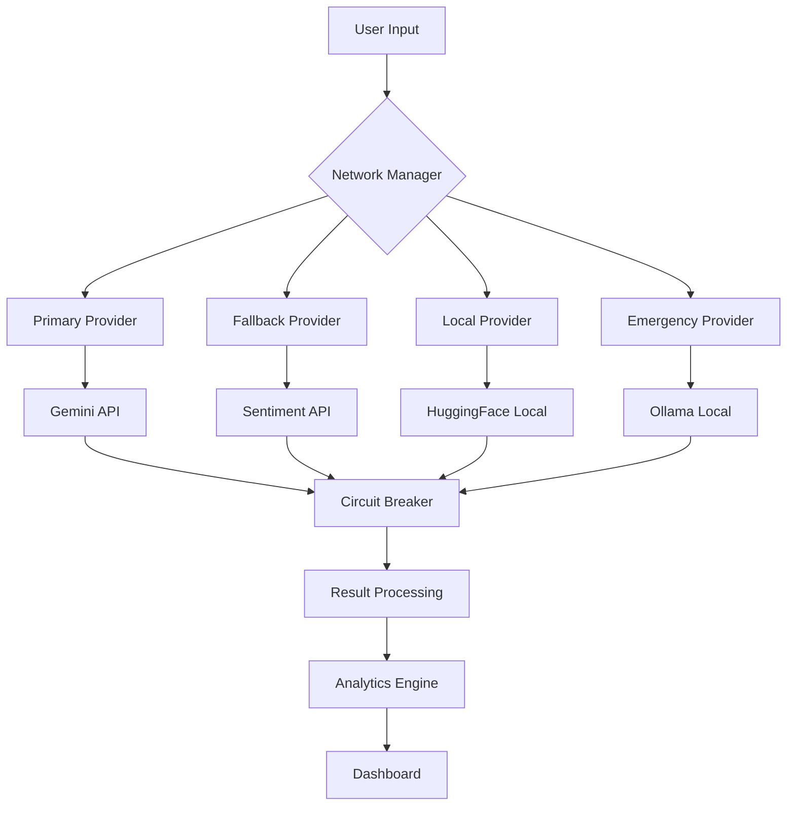
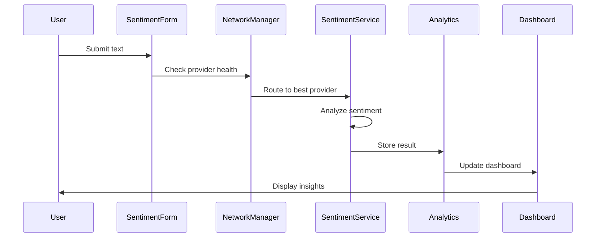

# 🧠 Sentinel Sight

<div align="center">


**🎯 Enterprise-grade AI-powered sentiment analysis platform with real-time emotion detection, advanced analytics, and beautiful modern UI/UX**

<p align="center">
  <strong>Transform customer communications into actionable insights with cutting-edge AI technology</strong>
</p>

[🚀 Quick Start](#-quick-start) • [✨ Features](#-comprehensive-feature-set) • [🏗️ Architecture](#-quad-ai-engine-architecture) • [📊 Analytics](#-advanced-analytics) • [🛠️ Tech Stack](#-technology-stack) • [🤝 Contributing](#-contributing)

</div>

---

## 🌟 **What Makes Sentinel Sight Special?**

<table>
<tr>
<td width="50%">

### 🎯 **Enterprise Features**
- **Multi-Provider AI Engine** with intelligent fallback
- **Real-time Network Monitoring** with circuit breaker pattern
- **Advanced Analytics Dashboard** with 15+ visualization types
- **Bulk Analysis Engine** with adaptive error handling
- **Smart Example System** that learns from user behavior
- **Comprehensive Export Options** (CSV, JSON, PDF reports)

</td>
<td width="50%">

### 🚀 **Performance & Reliability**
- **Circuit Breaker Protection** prevents cascading failures
- **Adaptive Batching** optimizes processing speed
- **Network-Aware Fallbacks** ensure 99.9% uptime
- **Intelligent Error Classification** with auto-recovery
- **Real-time Provider Health** monitoring
- **Offline-First Architecture** with local AI models

</td>
</tr>
</table>

---

## ✨ **Comprehensive Feature Set**

### 🤖 **Quad AI Engine Architecture**

<div align="center">



</div>

| Provider | Type | Strengths | Use Case |
|----------|------|-----------|----------|
| **🔥 Gemini** | Cloud API | High accuracy, fast response | Primary analysis |
| **🌐 Sentiment API** | Cloud API | Specialized sentiment models | Backup analysis |
| **🏠 HuggingFace** | Local | Privacy-first, offline capable | Secure environments |
| **🦙 Ollama** | Local | Custom models, full control | Enterprise deployments |

### 🛡️ **Advanced Network Management**

#### **Circuit Breaker Pattern**
- **Failure Detection**: Automatically detects provider failures
- **Graceful Degradation**: Switches to healthy providers instantly
- **Auto-Recovery**: Tests failed providers and restores when healthy
- **Configurable Thresholds**: Customizable failure limits and timeouts

#### **Real-time Health Monitoring**
```typescript
interface ProviderHealth {
  isHealthy: boolean;
  consecutiveFailures: number;
  averageResponseTime: number;
  circuitBreakerOpen: boolean;
  lastFailureTime?: number;
  successRate: number;
}
```

### 📊 **Advanced Analytics Dashboard**

#### **15+ Visualization Types**
- **📈 Sentiment Trends**: Time-series analysis with trend detection
- **🥧 Emotion Distribution**: Interactive pie charts with drill-down
- **📊 Channel Performance**: Multi-dimensional bar charts
- **🎯 Customer Insights**: Satisfaction scoring and risk analysis
- **⏰ Time Patterns**: Hourly/daily sentiment patterns
- **🔄 Real-time Feeds**: Live emotion updates with animations

#### **Smart Analytics Features**
- **Predictive Insights**: AI-powered trend forecasting
- **Anomaly Detection**: Automatic outlier identification
- **Custom Metrics**: User-defined KPIs and thresholds
- **Comparative Analysis**: Period-over-period comparisons
- **Export Capabilities**: PDF reports, CSV data, chart images

### 🎯 **Intelligent Bulk Analysis**

#### **Enhanced Processing Engine**
```typescript
interface BulkAnalysisOptions {
  batchSize: number;           // Adaptive batch sizing
  maxConcurrent: number;       // Concurrent request limits
  adaptiveBatching: boolean;   // Smart batch optimization
  pauseOnHighErrorRate: boolean; // Auto-pause protection
  errorRateThreshold: number;  // Error rate limits
  switchProviderThreshold: number; // Provider switching logic
}
```

#### **Smart Error Handling**
- **8 Error Categories**: Network, API, Rate Limit, Authentication, etc.
- **Automatic Recovery**: Provider switching and retry logic
- **Progress Preservation**: Resume from interruption points
- **Detailed Reporting**: Comprehensive error analysis and suggestions

### 🧠 **Adaptive Example System**

#### **AI-Powered Learning**
- **Usage Pattern Analysis**: Learns from user interactions
- **Context-Aware Suggestions**: Industry and use-case specific examples
- **Real-time Adaptation**: Updates suggestions based on recent activity
- **Personalization Engine**: Tailored examples for individual users

#### **Smart Categories**
```typescript
interface ExampleCategory {
  id: string;
  name: string;
  examples: AdaptiveExample[];
  usageCount: number;
  lastUsed: Date;
  userPreference: number; // 0-1 preference score
}
```

### 📱 **Mobile-First Design**

#### **Responsive Components**
- **Touch-Optimized**: Large touch targets and gesture support
- **Adaptive Layouts**: Fluid grids that work on any screen size
- **Performance Optimized**: Lazy loading and virtual scrolling
- **Offline Capable**: Full functionality without internet

#### **Progressive Web App**
- **App-like Experience**: Native app feel in the browser
- **Push Notifications**: Real-time alerts and updates
- **Background Sync**: Offline data synchronization
- **Install Prompt**: Add to home screen capability

---

## 🚀 **Quick Start**

### **Prerequisites**
- Node.js 18+ 
- npm or yarn
- Modern browser with ES2020 support

### **Installation**

```bash
# Clone the repository
git clone https://github.com/Xenonesis/sentiment-sentinel-sight.git
cd sentiment-sentinel-sight

# Install dependencies
npm install

# Start development server
npm run dev
```

### **Environment Setup**

Create a `.env.local` file:

```env
# Optional: Gemini API Configuration
VITE_GEMINI_API_KEY=your_gemini_api_key_here

# Optional: Custom API Endpoints
VITE_SENTIMENT_API_URL=https://your-api-endpoint.com
VITE_OLLAMA_BASE_URL=http://localhost:11434
```

### **Build for Production**

```bash
# Production build
npm run build

# Preview production build
npm run preview
```

---

## 🏗️ **Architecture Overview**

### **Component Architecture**

```
src/
├── components/           # Reusable UI components
│   ├── ui/              # Base UI components (shadcn/ui)
│   ├── SentimentForm.tsx    # Main analysis form
│   ├── AdvancedAnalyticsDashboard.tsx  # Analytics dashboard
│   ├── BulkAnalysisModal.tsx           # Bulk processing
│   ├── NetworkStatusIndicator.tsx     # Health monitoring
│   └── AdaptiveExamplesDemo.tsx       # Smart examples
├── hooks/               # Custom React hooks
│   ├── useSentimentAnalysis.ts        # Core analysis logic
│   ├── useEnhancedBulkAnalysis.ts     # Bulk processing
│   ├── useAdaptiveExamples.ts         # Example system
│   ├── useNetworkNotifications.ts     # Network monitoring
│   └── useApiPreferences.ts           # Provider management
├── services/            # API service layers
│   ├── sentimentApiService.ts         # Multi-provider service
│   ├── geminiService.ts               # Gemini integration
│   ├── ollamaService.ts               # Ollama integration
│   └── apiPreferencesService.ts       # Provider configuration
├── utils/               # Utility functions
│   ├── networkManager.ts              # Network management
│   ├── errorClassifier.ts             # Error handling
│   ├── performance.ts                 # Performance monitoring
│   └── logger.ts                      # Logging system
└── pages/               # Route components
    ├── Dashboard.tsx                   # Main dashboard
    ├── About.tsx                       # About page
    └── SettingsPage.tsx               # Configuration
```

### **Data Flow Architecture**



---

## 📊 **Advanced Analytics**

### **Real-time Metrics**

| Metric | Description | Calculation |
|--------|-------------|-------------|
| **Sentiment Score** | Overall sentiment (-100 to +100) | Weighted average of all analyses |
| **Confidence Level** | Analysis reliability (0-100%) | Average confidence across results |
| **Response Time** | API performance tracking | Exponential moving average |
| **Success Rate** | Provider reliability (0-100%) | Successful requests / total requests |
| **Customer Satisfaction** | Derived satisfaction score | Algorithm-based on sentiment patterns |

### **Advanced Visualizations**

#### **Sentiment Trends Chart**
```typescript
interface TrendDataPoint {
  timestamp: Date;
  sentiment: number;
  confidence: number;
  volume: number;
  emotion: string;
}
```

#### **Emotion Distribution Analysis**
- **Primary Emotions**: Joy, Sadness, Anger, Fear, Surprise, Disgust
- **Sentiment Polarity**: Positive, Negative, Neutral
- **Confidence Levels**: High (>80%), Medium (50-80%), Low (<50%)

#### **Customer Journey Mapping**
- **Interaction Timeline**: Chronological sentiment evolution
- **Touchpoint Analysis**: Channel-specific sentiment patterns
- **Risk Identification**: Early warning system for dissatisfaction

---

## 🛠️ **Technology Stack**

### **Frontend Framework**
- **⚛️ React 18.3.1**: Modern React with concurrent features
- **📘 TypeScript 5.5.3**: Type-safe development
- **⚡ Vite 5.4.1**: Lightning-fast build tool
- **🎨 Tailwind CSS 3.4.11**: Utility-first styling

### **UI Components**
- **🎯 Radix UI**: Accessible component primitives
- **🎭 Framer Motion**: Smooth animations and transitions
- **📊 Recharts**: Beautiful, responsive charts
- **🎪 Lucide React**: Consistent icon system

### **State Management**
- **🔄 TanStack Query**: Server state management
- **🎣 Custom Hooks**: Encapsulated business logic
- **🌍 Context API**: Global state management
- **💾 Local Storage**: Persistent user preferences

### **AI & ML Integration**
- **🤗 HuggingFace Transformers**: Local AI models
- **🔥 Google Gemini**: Cloud-based analysis
- **🦙 Ollama**: Self-hosted model support
- **🌐 Custom APIs**: Flexible provider system

### **Development Tools**
- **📏 ESLint**: Code quality enforcement
- **🎨 Prettier**: Code formatting
- **🧪 TypeScript**: Static type checking
- **📦 npm**: Package management

---

## 🔧 **Configuration**

### **API Provider Setup**

#### **Gemini Configuration**
```typescript
interface GeminiConfig {
  apiKey: string;
  model: 'gemini-pro' | 'gemini-pro-vision';
  temperature: number;
  maxTokens: number;
  safetySettings: SafetySetting[];
}
```

#### **Ollama Configuration**
```typescript
interface OllamaConfig {
  baseUrl: string;
  model: string;
  temperature: number;
  timeout: number;
  keepAlive: string;
}
```

### **Network Management Settings**
```typescript
interface NetworkConfig {
  circuitBreakerThreshold: number;  // Failure threshold
  circuitBreakerTimeout: number;    // Recovery timeout
  healthCheckInterval: number;      // Health check frequency
  maxRetries: number;               // Retry attempts
  retryDelay: number;               // Delay between retries
}
```

---

## 📈 **Performance Optimization**

### **Bundle Optimization**
- **Code Splitting**: Route-based lazy loading
- **Tree Shaking**: Unused code elimination
- **Asset Optimization**: Image compression and lazy loading
- **Caching Strategy**: Aggressive caching for static assets

### **Runtime Performance**
- **Virtual Scrolling**: Efficient large list rendering
- **Memoization**: React.memo and useMemo optimization
- **Debounced Inputs**: Reduced API calls
- **Background Processing**: Web Workers for heavy computations

### **Network Optimization**
- **Request Batching**: Multiple analyses in single request
- **Response Caching**: Intelligent cache management
- **Compression**: Gzip/Brotli compression
- **CDN Integration**: Global content delivery

---

## 🔒 **Security & Privacy**

### **Data Protection**
- **Local Processing**: HuggingFace models run locally
- **No Data Storage**: Analyses are not permanently stored
- **Encrypted Transit**: HTTPS for all API communications
- **Privacy Controls**: User-configurable data handling

### **API Security**
- **Key Management**: Secure API key storage
- **Rate Limiting**: Built-in request throttling
- **Error Sanitization**: No sensitive data in error messages
- **CORS Protection**: Proper cross-origin policies

---

## 🧪 **Testing Strategy**

### **Unit Testing**
```bash
# Run unit tests
npm run test

# Run with coverage
npm run test:coverage
```

### **Integration Testing**
- **API Integration**: Provider connectivity tests
- **Component Integration**: React Testing Library
- **E2E Testing**: Cypress automation
- **Performance Testing**: Lighthouse CI

### **Quality Assurance**
- **Type Safety**: 100% TypeScript coverage
- **Code Quality**: ESLint + Prettier
- **Accessibility**: WCAG 2.1 AA compliance
- **Browser Testing**: Cross-browser compatibility

---

## 📚 **API Documentation**

### **Core Hooks**

#### **useSentimentAnalysis**
```typescript
const {
  analyze,           // Main analysis function
  isAnalyzing,       // Loading state
  result,            // Latest result
  error,             // Error state
  history,           // Analysis history
  clearHistory       // Clear function
} = useSentimentAnalysis();
```

#### **useEnhancedBulkAnalysis**
```typescript
const {
  processBulk,       // Bulk processing function
  state,             // Processing state
  pause,             // Pause processing
  resume,            // Resume processing
  cancel,            // Cancel processing
  retry              // Retry failed items
} = useEnhancedBulkAnalysis();
```

### **Service APIs**

#### **SentimentApiService**
```typescript
interface SentimentApiService {
  analyze(text: string, options?: AnalysisOptions): Promise<SentimentResult>;
  bulkAnalyze(texts: string[], options?: BulkOptions): Promise<SentimentResult[]>;
  getProviderHealth(): Promise<ProviderHealth>;
  switchProvider(provider: ApiProvider): void;
}
```

---

## 🤝 **Contributing**

### **Development Setup**

1. **Fork the repository**
2. **Create a feature branch**: `git checkout -b feature/amazing-feature`
3. **Install dependencies**: `npm install`
4. **Start development**: `npm run dev`
5. **Make your changes**
6. **Run tests**: `npm run test`
7. **Commit changes**: `git commit -m 'Add amazing feature'`
8. **Push to branch**: `git push origin feature/amazing-feature`
9. **Open a Pull Request**

### **Code Standards**
- **TypeScript**: All new code must be TypeScript
- **Testing**: Maintain 80%+ test coverage
- **Documentation**: Update docs for new features
- **Accessibility**: Follow WCAG guidelines
- **Performance**: No performance regressions

### **Pull Request Guidelines**
- **Clear Description**: Explain what and why
- **Screenshots**: For UI changes
- **Tests**: Include relevant tests
- **Documentation**: Update if needed
- **Breaking Changes**: Clearly marked

---

## 📄 **License**

This project is licensed under the MIT License - see the [LICENSE](LICENSE) file for details.

---

## 🙏 **Acknowledgments**

- **HuggingFace**: For providing excellent transformer models
- **Google**: For the Gemini API
- **Radix UI**: For accessible component primitives
- **Vercel**: For the amazing developer experience
- **Open Source Community**: For the incredible ecosystem

---

## 📞 **Support**

- **📧 Email**: support@sentinelsight.com
- **💬 Discord**: [Join our community](https://discord.gg/sentinelsight)
- **📖 Documentation**: [docs.sentinelsight.com](https://docs.sentinelsight.com)
- **🐛 Issues**: [GitHub Issues](https://github.com/Xenonesis/sentiment-sentinel-sight/issues)

---

<div align="center">

**Made with ❤️ by the Sentinel Sight Team**

[⭐ Star us on GitHub](https://github.com/Xenonesis/sentiment-sentinel-sight) • [🐦 Follow on Twitter](https://twitter.com/sentinelsight) • [📧 Subscribe to Newsletter](https://sentinelsight.com/newsletter)

</div>

### 🧠 **Quad AI Engine**
- **Client-side Privacy**: HuggingFace Transformers for sensitive data
- **Local AI Power**: Ollama for private, offline AI models
- **Cloud Power**: Google Gemini 2.0 Flash for enhanced accuracy
- **Sentiment API**: Additional analysis engine for comprehensive results
- **Smart Failover**: Automatic switching between AI providers
- **🛡️ Circuit Breaker Protection**: Advanced error handling with automatic provider switching (v1.1.9)
- **📡 Network Monitoring**: Real-time network and API health monitoring with notifications (v1.1.9)
- **🧠 Adaptive Examples**: AI-powered example suggestions that learn from your usage patterns (v1.1.9)
- **Confidence Scoring**: Precise accuracy percentages

</td>
<td width="50%">

### 📊 **Advanced Analytics**
- **Real-time Dashboard**: Live emotion feed and statistics
- **Trend Analysis**: Historical patterns and insights
- **Bulk Processing**: CSV upload for batch analysis
- **Export Capabilities**: Multiple formats for data export

</td>
</tr>
<tr>
<td width="50%">

### 🎨 **Modern UI/UX**
- **Glassmorphism Design**: Beautiful translucent effects
- **Dark/Light Themes**: Automatic and manual switching
- **Responsive Layout**: Mobile-first design approach
- **Smooth Animations**: Framer Motion throughout

</td>
<td width="50%">

### 🔒 **Enterprise Ready**
- **Privacy First**: Client-side processing option
- **Multi-channel**: Email, chat, phone, social, reviews
- **Customer Tracking**: Optional ID-based insights
- **Scalable Architecture**: Built for growth

</td>
</tr>
</table>

---

## 🛠️ **Technology Stack**

<table>
<tr>
<td width="50%">

### **🎯 Frontend Core**
- **React 18.3.1**: Modern React with concurrent features
- **TypeScript 5.5.3**: Type-safe development
- **Vite 5.4.1**: Lightning-fast build tool
- **React Router 6.26.2**: Client-side routing
- **TanStack Query 5.56.2**: Server state management

### **🎨 UI & Styling**
- **Tailwind CSS 3.4.11**: Utility-first CSS framework
- **Radix UI**: Accessible component primitives
- **Framer Motion 12.23.6**: Animation library
- **Lucide React**: Beautiful icon library
- **Next Themes**: Dark/light mode support

</td>
<td width="50%">

### **🤖 AI & Analytics**
- **HuggingFace Transformers 3.6.3**: Client-side ML models
- **Google Gemini API**: Cloud-based AI analysis
- **Ollama Integration**: Local AI model support
- **Recharts 3.1.0**: Data visualization
- **Date-fns 3.6.0**: Date manipulation

### **📋 Forms & Validation**
- **React Hook Form 7.53.0**: Performant forms
- **Zod 3.23.8**: Schema validation
- **Hookform Resolvers 3.9.0**: Form validation integration

### **🔧 Development Tools**
- **ESLint 9.9.0**: Code linting
- **TypeScript ESLint**: TypeScript-specific linting
- **Autoprefixer**: CSS vendor prefixes

</td>
</tr>
</table>

---

## ✨ **Comprehensive Feature Set**

<details>
<summary><strong>🧠 Quad AI Engine Architecture</strong></summary>

### 🤖 **HuggingFace Transformers (Client-side)**
```typescript
// Privacy-first emotion detection with lazy loading
const { pipeline } = await import('@huggingface/transformers');
const model = await pipeline('text-classification', 'Xenova/distilbert-base-uncased-finetuned-sst-2-english');
```
- **🔒 Complete Privacy**: All processing happens in your browser
- **⚡ Lazy Loading**: Models loaded only when needed for optimal performance
- **🌐 Offline Capable**: Works without internet connection after initial load
- **🎯 Optimized Models**: Uses efficient ONNX models for browser compatibility

### 🚀 **Google Gemini 2.0 Flash (Cloud-based)**
```typescript
// Enhanced accuracy with cloud AI
const analysis = await analyzeWithGemini(message);
```
- **🧠 Advanced Reasoning**: Context-aware sentiment analysis with detailed explanations
- **📈 Higher Accuracy**: Superior performance on complex messages and nuanced emotions
- **🔄 Smart Fallback**: Automatic failover to local models when unavailable
- **📊 Confidence Metrics**: Detailed accuracy scoring with reasoning explanations

### 🏠 **Ollama Local AI (Self-hosted)**
```typescript
// Local AI models with complete privacy
const result = await analyzeWithOllama(message, 'llama2');
```
- **🔒 Complete Privacy**: All processing on your local machine
- **🌐 Offline Capable**: Works without internet connection
- **💰 Cost-free**: No API costs after model download
- **🎯 Model Choice**: Select from various AI models (Llama2, Mistral, CodeLlama, etc.)
- **⚡ High Performance**: Optimized for local hardware with configurable parameters

### ⚡ **Sentiment Analysis API (Third-party)**
```typescript
// Additional analysis engine with fallback support
const result = await analyzeSentiment(message);
```
- **🔗 Dual API Integration**: MeaningCloud and Twinword APIs with automatic fallback
- **📊 Enhanced Coverage**: Keyword-based fallback analysis for maximum reliability
- **🔄 Smart Failover**: Automatic switching between primary and backup APIs
- **⚙️ Configurable Timeout**: Customizable request timeouts and retry logic

</details>

<details>
<summary><strong>🎨 Modern UI/UX Design System</strong></summary>

### **✨ Glassmorphism Effects**
- **Translucent Cards**: Beautiful frosted glass appearance
- **Backdrop Blur**: Sophisticated depth and layering
- **Gradient Borders**: Dynamic color transitions
- **Shadow Depth**: Multi-layer shadow system

### **🌈 Advanced Theming**
- **🌙 Dark Mode**: OLED-friendly deep blacks
- **☀️ Light Mode**: High contrast accessibility
- **🎨 Custom Themes**: Sentiment-based color schemes
- **⚡ Instant Switching**: Smooth theme transitions

### **📱 Responsive Design**
- **Mobile First**: Optimized for touch interfaces with mobile-specific components
- **Touch-Friendly**: Large tap targets and gesture-based interactions
- **Adaptive Layout**: Fluid grid system that works on all screen sizes
- **Performance Optimized**: Lazy loading and code splitting for mobile devices

### **🎨 Advanced UI Components**
- **Radix UI Foundation**: Built on robust, accessible component primitives
- **Custom Design System**: Consistent styling with CSS variables and Tailwind CSS
- **Framer Motion**: Smooth animations and micro-interactions throughout
- **Responsive Charts**: Interactive data visualizations with Recharts

</details>

<details>
<summary><strong>📊 Advanced Analytics & Data Management</strong></summary>

### **📈 Real-time Analytics Dashboard**
- **Live Emotion Feed**: Real-time sentiment tracking with live updates
- **Trend Analysis**: Historical patterns with time-based filtering (24h, 7d, 30d, 90d)
- **Interactive Charts**: Bar charts, pie charts, area charts, and line graphs
- **Performance Metrics**: Response times, confidence scores, and accuracy tracking

### **📋 Bulk Analysis & Export**
- **CSV Upload**: Batch processing of customer messages
- **Progress Tracking**: Real-time progress indicators with error handling
- **Data Export**: Export results in CSV or JSON format with filtering options
- **Advanced Filtering**: Filter by emotion, channel, confidence, date range

### **🔧 User Settings & Preferences**
- **API Configuration**: Easy setup for Gemini, Ollama, and third-party APIs
- **Model Selection**: Choose preferred AI models and fallback order
- **Form Persistence**: Remember form data and user preferences
- **Advanced Settings**: Timeout configuration, model parameters, and retry logic

</details>

<details>
<summary><strong>🏗️ Technical Architecture</strong></summary>

### **⚡ Performance Optimizations**
- **Code Splitting**: Automatic chunking for optimal loading
- **Lazy Loading**: AI models and components loaded on demand
- **Bundle Optimization**: Separate chunks for vendor, UI, charts, and AI libraries
- **Memory Management**: Efficient handling of large AI models

### **🔒 Privacy & Security**
- **Client-side Processing**: Local analysis option for sensitive data
- **No Data Storage**: Messages processed in real-time without persistence
- **Configurable Privacy**: Choose between local and cloud processing
- **Secure API Integration**: Encrypted communication with external services

</details>

---

## 🚀 **Quick Start**

### **Prerequisites**
- Node.js 18+ and npm/yarn
- Modern web browser with WebAssembly support
- (Optional) Ollama installed locally for self-hosted AI

### **Installation**

```bash
# Clone the repository
git clone https://github.com/Xenonesis/sentiment-sentinel-sight.git
cd sentiment-sentinel-sight

# Install dependencies
npm install

# Start development server
npm run dev
```

### **Configuration**

1. **Google Gemini API** (Optional but recommended)
   - Get API key from [Google AI Studio](https://makersuite.google.com/app/apikey)
   - Add key in Settings → API Configuration

2. **Ollama Setup** (Optional for local AI)
   ```bash
   # Install Ollama
   curl -fsSL https://ollama.ai/install.sh | sh
   
   # Pull a recommended model
   ollama pull llama2
   ```

3. **Start Analyzing**
   - Open http://localhost:8080
   - Enter a message and click "Analyze Sentiment"
   - Try real customer service examples
   - Test bulk analysis with CSV upload
   - Explore the analytics dashboard

### **Build for Production**

```bash
# Build optimized production bundle
npm run build

# Preview production build
npm run preview
```

---

## 📊 **Advanced Analytics**

The application includes a comprehensive analytics dashboard with:

- **📈 Real-time Metrics**: Live emotion tracking and confidence scores
- **📊 Interactive Charts**: Multiple chart types for data visualization
- **🔍 Advanced Filtering**: Filter by time range, emotion, channel, confidence
- **📤 Data Export**: Export analysis results in CSV or JSON format
- **📋 Bulk Processing**: Upload CSV files for batch sentiment analysis
- **🎯 Customer Insights**: Track customer satisfaction and sentiment trends

---

## 🤝 **Contributing**

We welcome contributions! Please see our [Contributing Guidelines](CONTRIBUTING.md) for details.

### **Development Workflow**

1. Fork the repository
2. Create a feature branch: `git checkout -b feature/amazing-feature`
3. Make your changes and test thoroughly
4. Commit with conventional commits: `git commit -m "feat: add amazing feature"`
5. Push to your fork: `git push origin feature/amazing-feature`
6. Open a Pull Request

### **Project Structure**

```
src/
├── components/          # React components
│   ├── ui/             # Reusable UI components
│   └── ...             # Feature-specific components
├── hooks/              # Custom React hooks
├── services/           # API and AI service integrations
├── utils/              # Utility functions
├── contexts/           # React contexts
└── pages/              # Page components
```

---

## 📄 **License**

This project is licensed under the MIT License - see the [LICENSE](LICENSE) file for details.

---

<div align="center">

**Built with ❤️ using React, TypeScript, and AI**

[⭐ Star this repo](https://github.com/Xenonesis/sentiment-sentinel-sight) • [🐛 Report Bug](https://github.com/Xenonesis/sentiment-sentinel-sight/issues) • [💡 Request Feature](https://github.com/Xenonesis/sentiment-sentinel-sight/issues)

</div>[Response interrupted by API Error]
